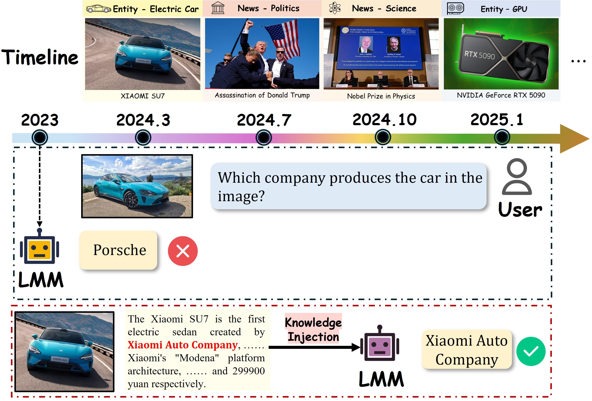
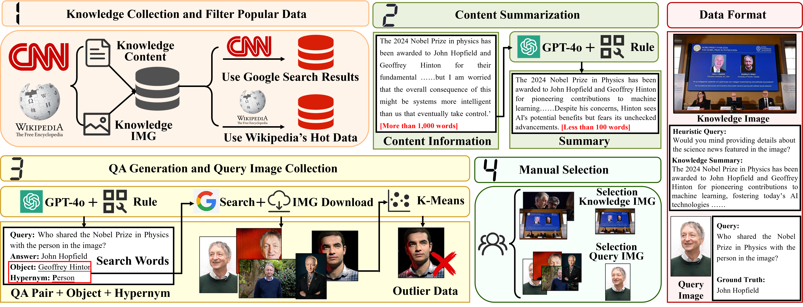
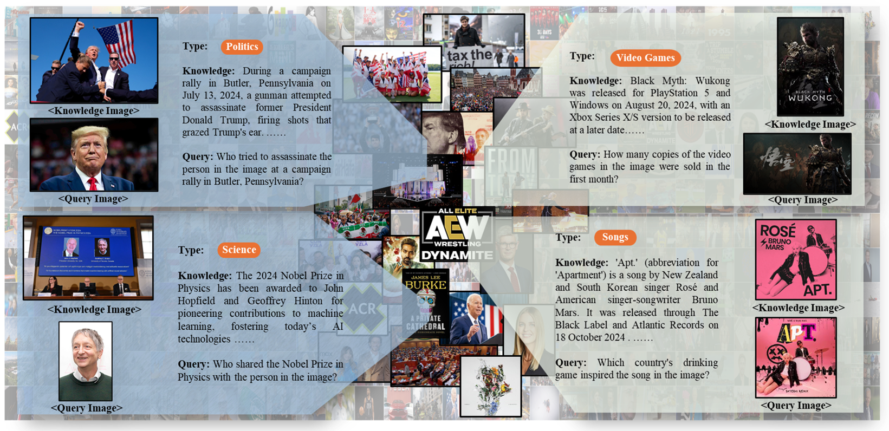

<h1 align="center"> <a href="https://arxiv.org/abs/2406.11194">When Large Multimodal Models Confront Evolving Knowledge: Challenges and Pathways</a></h1>
<h5 align="center">

[](https://arxiv.org/pdf/2502.19870) [](https://huggingface.co/datasets/kailinjiang/MMKE-Bench-dataset)  [](https://paperswithcode.com/paper/mmke-bench-a-multimodal-editing-benchmark-for)  [](https://github.com/EVOKE-LMM/EVOKE) [](https://mmke-bench-iclr.github.io/) [](https://mp.weixin.qq.com/s/iN826lITi5Xyz-3GnrdVIQ)


</h5>


## Table of Contents

- [🤗EVOKE](#evoke)
- [🛠️Requirements and Installation](#️requirements-and-installation)
- [🌟Retrieval](#retrieval)
- [💥Training](#training)
- [🤖Evaluation](#evaluation)


## 🤗EVOKE

<div align="center">    </div>

To evaluate evolving knowledge injection in LMMs, we propose a pipeline to automatically collect evolving knowledge, constructing the <u><b>EVO</b></u>lving <u><b>K</b></u>nowledg<u><b>E</b></u> <b>(EVOKE)</b> benchmark.

<div align="center">    </div>

You can download data 🤗 [Huggingface Dataset](https://huggingface.co/datasets/kailinjiang/EVOKE). And the expected structure of files is:


```text
EVOKE
|-- json/jsonl
|   |-- evoke_injection_data.json
|   |-- evoke_evaluation_data.jsonl
|-- imgs
|   |-- injection
|   |   |-- evoke_entity_injection_imgs.zip
|   |   |-- evoke_news_injection_imgs.zip
|   |-- evaluation
|   |   |-- evoke_news_evaluation_imgs.zip
|   |   |-- evoke_entity_evaluation_imgs.zip
```


<div align="center">    </div>

## 🛠️Requirements and Installation

```text
Please refer to the code repository

https://github.com/haotian-liu/LLaVA

https://github.com/QwenLM/Qwen-VL

https://github.com/TIGER-AI-Lab/UniIR
```

## 🌟Retrieval

```shell
For image_only:

python retrieval/retrieval_image_only.py

For text_only:
python retrieval/retrieval_text_only.py

For UniIR:
step1
python retrieval/UniIR/src/common/mbeir_retriever.py

get retrieval/UniIR/retrieval_results/CLIP_SF/Large/Instruct/UniRAG/run_files/mbeir_new_self_union_pool_test_k10_run.txt

step2
python retrieval/retrieval_UniIR.py
```


## 💥Training


```shell
Please refer to the code repository

https://github.com/haotian-liu/LLaVA

https://github.com/QwenLM/Qwen-VL
```


## 🤖Evaluation

```shell
step1
python evaluation/eval_acc_f1.py

step2
python evaluation/all_type_score.py
```
